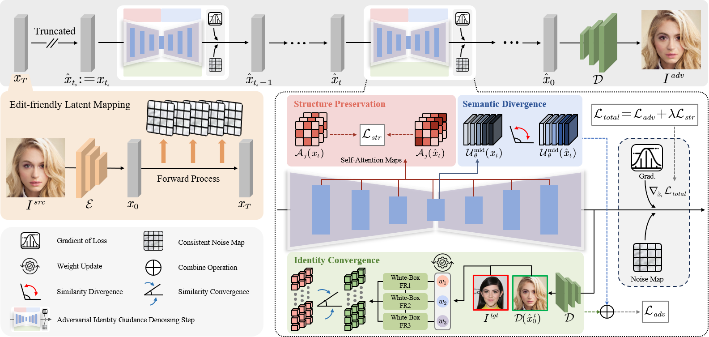

# Diffusion-based Adversarial Identity Manipulation for Facial Privacy Protection (ACM MM 2025)

[](https://arxiv.org/abs/2504.21646)

<p align="center">
  

This repository contains the official implementation of the paper: [Diffusion-based Adversarial Identity Manipulation for Facial Privacy Protection](https://arxiv.org/abs/2504.21646), which is accepted by ACM MM 2025.

If you find this repository useful for your research or work, we would greatly appreciate it if you could star this repository ✨ and cite our paper 📚.

## 🎯 Abstract

The success of face recognition (FR) systems has led to serious privacy concerns due to potential unauthorized surveillance and user tracking on social networks. Existing methods for enhancing privacy fail to generate natural face images that can protect facial privacy. In this paper, we propose diffusion-based adversarial identity manipulation (DiffAIM) to generate natural and highly transferable adversarial faces against malicious FR systems. To be specific, we manipulate facial identity within the low-dimensional latent space of a diffusion model. This involves iteratively injecting gradient-based adversarial identity guidance during the reverse diffusion process, progressively steering the generation toward the desired adversarial faces. The guidance is optimized for identity convergence towards a target while promoting semantic divergence from the source, facilitating effective impersonation while maintaining visual naturalness. We further incorporate structure-preserving regularization to preserve facial structure consistency during manipulation. Extensive experiments on both face verification and identification tasks demonstrate that compared with the state-of-the-art, DiffAIM achieves stronger black-box attack transferability while maintaining superior visual quality. We also demonstrate the effectiveness of the proposed approach for commercial FR APIs, including Face++ and Aliyun.

## 🔧 Setup

1. **Get code**

```shell
git clone https://github.com/Liqin-Wang/DiffAIM.git
```

2. **Build environment**

```shell
cd DiffAIM
# use anaconda to build environment
conda create -n diffaim python=3.11
conda activate diffaim
# install packages
pip install -r requirements.txt
```

## 📊 Pretrained models and datasets

1. **Download the pretrained stable diffusion**

   - Dowload the pretrained stable diffusion v1.5 from [here](https://huggingface.co/stable-diffusion-v1-5/stable-diffusion-v1-5).

   - Place the weights in the `pretrained` folder.

2. **Download the pretrained face recognition models and datasets**

   - To acquire pretrained face recognition models and datasets, including target images, please refer to the AMT-GAN page [here](https://github.com/CGCL-codes/AMT-GAN).

   - Place the pretrained face recognition models in `pretrained` folder.

   - Place the CelebA-HQ in `dataset` folder. Additionally, you need to select several target images and source images and organize them into `src` and `target` subfolders.

The final project should be like this:

```shell
DiffAIM
  └- pretrained
       └- stable-diffusion-v1-5
       └- ir152.pth
       └- irse50.pth
       └- mobile_face.pth
       └- facenet.pth
  └- dataset
       └- src
       └- target
  └- ...
```

## 🚀 Usage

The core functionality is in `main.py`. You can generate the protected faces by running the following command:

```shell
python main.py --device_id 0 --image_size 256 --num 5 --target_model IR152 --save results
```

You can find more information about the use of parameters in `config.py`.

## 📚 Citation

If you find our work helpful, please consider citing:

```bibtex
@misc{wang2025diffusionbasedadversarialidentitymanipulation,
      title={Diffusion-based Adversarial Identity Manipulation for Facial Privacy Protection},
      author={Liqin Wang and Qianyue Hu and Wei Lu and Xiangyang Luo},
      year={2025},
      eprint={2504.21646},
      archivePrefix={arXiv},
      primaryClass={cs.CV},
      url={https://arxiv.org/abs/2504.21646},
}
```
